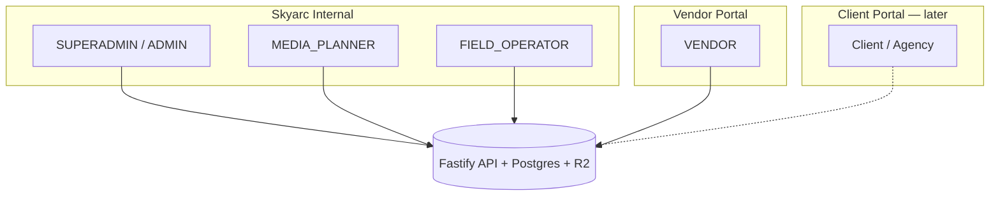

# Skyarc Atlas — Product Plan

**Status:** Single source of truth for product, architecture, and roadmap  
**Last updated:** 2026-08-28  
**Branch:** `feature/organizations-rbac` (in progress)

---

## Executive summary

Skyarc Atlas is a **DOOH location intelligence and AI media planning platform** evolving from an internal tool into a **multi-vendor marketplace with client-facing campaign delivery**.

**Product positioning:** *Plan smarter outdoor campaigns — verified sites, real availability, AI-backed recommendations.*

| Audience | What they get |
|----------|---------------|
| **Skyarc team** (operators) | Full control, margins, governance, planning |
| **Vendors** (media owners) | List inventory, set rates & commercial terms, manage availability |
| **Clients / agencies** (later) | Campaign briefs, recommended plans, clean presentation — ticks not scores |

**Architecture (unchanged from Phase 0):** Monolithic Fastify API + PostgreSQL/PostGIS + R2 + shared packages. Web (Next.js) and mobile (Expo). API owns all business logic and authorization.

**Next delivery wave (MVP):** Inventory types, vendor inventory edit + commercial terms, simplified RBAC, server-side pricing visibility, media plan PDF export.

---

## 1. Product shape — three portals, one platform



**Authorization approach:** Role-based access with **ownership checks** (`organizationId` on locations/inventory). No permission matrix or workflow engine for MVP. API strips unauthorized fields from responses — not UI-only hiding.

---

## 2. What is already built

### Phase 0–5 foundation (on `main`)

| Area | Status |
|------|--------|
| Monorepo (pnpm, Turborepo) | ✅ |
| Fastify API + Prisma + PostGIS | ✅ |
| Auth (JWT, refresh, RBAC hooks) | ✅ |
| Locations, assets, R2 uploads, scoring, AI analysis | ✅ |
| Campaigns, media plans, deterministic optimizer | ✅ |
| Expo mobile field survey + offline sync | ✅ |
| Next.js web (dashboard, map, campaigns, plan insights) | ✅ |
| Docker / VPS deployment scaffolding | ✅ |

### Feature 1 — Organizations & RBAC API (`feature/organizations-rbac`)

| Item | Status |
|------|--------|
| `Organization` model (INTERNAL / VENDOR / CLIENT) | ✅ |
| Org status: ACTIVE / SUSPENDED / BLACKLISTED | ✅ |
| Location scoping by `organizationId` | ✅ |
| JWT includes `organizationId` | ✅ |
| Admin org APIs (create, suspend, blacklist) | ✅ |
| Seed: `admin@skyarc.in`, `vendor@skyarc.in` | ✅ |

### Feature 1b — Web RBAC & vendor portal (uncommitted on branch)

| Item | Status |
|------|--------|
| Shared `packages/shared/src/rbac.ts` | ✅ |
| AuthProvider, route guards, role-based sidebar | ✅ |
| Vendor lands on `/locations`; internal on `/dashboard` | ✅ |
| `/organization` page | ✅ |
| `/admin/organizations` | ✅ |
| Hide edit/delete for read-only roles | ✅ |

### Feature 1c — Profile, inventory, commercial (partial on branch)

| Item | Status |
|------|--------|
| `GET/PATCH /users/me` | ✅ |
| `/account` page | ✅ |
| `PlatformConfig` + Skyarc margin % (admin) | ✅ |
| Basic screen/inventory/rate-card API | ✅ |
| Location inventory panel (create only) | ⚠️ partial |
| Internal plan pricing breakdown | ✅ |
| Vendor margin (org + per-location) | ❌ |
| Full inventory edit/delete | ❌ |
| `DIGITAL` / `STATIC` types | ❌ |
| PDF export | ❌ |

---

## 3. Design principles

1. **API is the security boundary** — UI hides; API omits unauthorized fields.
2. **Never coerce missing data to zero** — use `NOT_AVAILABLE`, `NOT_APPLICABLE`, `UNKNOWN`.
3. **MVP over abstraction** — no workflow engines, quotation systems, or permission matrices.
4. **Structured export** — PDFs from JSON snapshots, not screenshots.
5. **Ownership + role** — access = role check AND org/location ownership where applicable.
6. **Same codebase, different portals** — route by role after login.

---

## 4. Roles (MVP target)

Consolidate to **five roles**. Migrate away from `VENDOR_ADMIN`, `VENDOR_OPS`, `SALES`, `VIEWER`, `CLIENT_VIEWER`.

| Role | Portal | Can do |
|------|--------|--------|
| **SUPERADMIN** | Internal | Everything + platform config; superset of ADMIN |
| **ADMIN** | Internal | All orgs, inventory, pricing, vendor governance |
| **MEDIA_PLANNER** | Internal | Campaigns, plans, customer-facing prices, PDF export |
| **FIELD_OPERATOR** | Internal / field | Survey, photos, field updates — **no pricing in API responses** |
| **VENDOR** | Vendor | Own inventory, vendor commercial terms, discovery (no others' pricing) |

**Migration mapping:**

| Old role | New role |
|----------|----------|
| `ADMIN` | `ADMIN` or `SUPERADMIN` (seed admin) |
| `MEDIA_PLANNER` | `MEDIA_PLANNER` |
| `SALES`, `VIEWER` | `MEDIA_PLANNER` or `FIELD_OPERATOR` |
| `FIELD_OPERATOR` | `FIELD_OPERATOR` |
| `VENDOR_ADMIN`, `VENDOR_OPS` | `VENDOR` |
| `CLIENT_VIEWER` | Deferred |

### VENDOR rules (summary)

| Action | Allowed |
|--------|---------|
| View/edit **own** inventory | ✅ |
| View **other** inventory (discovery) | ✅ — name, location, road, type, images — **no pricing** |
| View other vendors' pricing | ❌ |
| View Skyarc customer-facing pricing | ❌ |
| Manage own vendor margin % (org default + per-location) | ✅ |
| Request pricing for non-owned inventory | ✅ (simple request record) |
| Campaigns / media plans / PDF with client prices | ❌ |

### Pricing visibility (server-side)

| Field | VENDOR (own) | VENDOR (other) | FIELD_OPERATOR | MEDIA_PLANNER | ADMIN |
|-------|:------------:|:----------------:|:--------------:|:-------------:|:-----:|
| `vendorNetRate` | ✅ | omit | omit | ✅ | ✅ |
| `vendorMarginPercent` | ✅ | omit | omit | ✅ | ✅ |
| `skyarcMarginPercent` | omit | omit | omit | ✅ | ✅ |
| `clientRate` | omit | omit | omit | ✅ | ✅ |

---

## 5. Inventory formats & media types (Open & extensible)

### 5.1 Formats (Unconstrained)

Inventory type is **open and extensible** (string with standard presets + custom entries). The platform is not limited to just digital vs static billboards.

| Preset | Description |
|--------|-------------|
| `DIGITAL_BILLBOARD` | LED / large format DOOH screens, loop durations, operating hours |
| `STATIC_BILLBOARD` | Traditional hoarding / static billboard, vinyl/flex, front/back-lit |
| `UNIPOLE` | High-rise single pole billboard |
| `GANTRY` | Road spanning gantry / Foot Overbridge (FOB) panel |
| `BUS_SHELTER` | Bus Queue Shelter (BQS) panels / MUPIs |
| `KIOSK` | Interactive touch / display kiosk, mall/airport totems |
| `STANDEE` | Digital or physical roll-up standees (retail, lobbies) |
| `DIGITAL_TV` | Indoor screens (lifts, corporate towers, gyms, retail stores) |
| `TRANSIT_BUS` | Bus exterior full/side wrap, rear panel |
| `TRANSIT_AUTO` | Auto-rickshaw / cab branding and hoods |
| `TRANSIT_METRO` | Metro train exterior wraps, station pillar panels, in-train displays |
| `MALL_MEDIA` | Atrium banners, hanging media, escalator branding |
| `AIRPORT_MEDIA` | Baggage claim displays, conveyor belt arches, pillar wraps |
| `OTHER / CUSTOM` | Freeform format (e.g. Golf course screens, Fuel station LEDs, Drone show) |

### 5.2 Hierarchy (unchanged)

```
Organization (vendor)
  └── Location
        └── Screen (face / unit label)
              └── Inventory (product + inventoryType)
                    └── RateCard (vendor net rate)
```

### 5.3 Specifications & attributes

**Common:** `productCode`, `status`, `notes`, `inventoryType` (open string), images via `LocationAsset`, availability windows.

**Format-specific specs:** stored in `staticSpecsJson` / format specs:
- Digital/LED/TVs: `loopDurationSec`, `slotDurationSec`, `operatingHoursJson`, resolution, aspect ratio
- Static/Transit/Print: dimensions (w x h), mounting, illumination (front-lit, backlit, non-lit), material, vehicle count, location type

### 5.4 Missing data semantics

| State | Meaning |
|-------|---------|
| `SET` | Value present and valid |
| `NOT_AVAILABLE` | Applicable but not yet captured |
| `NOT_APPLICABLE` | Does not apply to this inventory type |
| `UNKNOWN` | Applicable but source/confidence unknown |

**Rules:** `null` in DB; never default to `0` in optimizer, PDF, or totals. Plans and PDFs omit format-irrelevant fields and format labels cleanly (e.g. "Bus Queue Shelter (BQS)").

---

## 6. Commercial & pricing

### 6.1 Pricing layers (keep separate)

| Layer | Field | Set by | Visible to |
|-------|--------|--------|------------|
| Vendor net rate | `RateCard.amount` | Vendor (own inventory) | Vendor (own), Admin, Planner — **never customer** |
| Vendor margin % | `vendorMarginPercent` | Vendor — org default + location override | Vendor (own), Admin |
| **Customer price** | `Location.skyarcCommercialJson.clientRateAmount` | **Admin / Planner** — explicit per site | Admin, Planner, PDF — **never Vendor** |
| Implied Skyarc margin | derived | System (informational) | Admin, Planner when both vendor net + customer price exist |

```
vendorNetRate     = RateCard.amount          // internal only
customerPrice     = skyarcCommercialJson.clientRateAmount   // Skyarc sets independently
impliedMarginPct  = (customerPrice - vendorNetRate) / customerPrice * 100   // display only
skyarcRevenue     = customerPrice - vendorNetRate
```

**Business rule:** A vendor may list ₹1,00,000 on their rate card, but Skyarc can show the customer ₹1,50,000 (or any other price). Customer price is **not** `vendorRate / (1 - margin%)`.

**Deprecated:** `skyarcMarginPercent` on org/platform as a formula driver for client rate — may remain as internal metadata but does not auto-set customer prices.

### 6.2 JSON shapes

```ts
// Organization.vendorCommercialJson — vendor-editable
{ defaultVendorMarginPercent?, currency?, paymentTermsDays?, notes? }

// Location.commercialJson — vendor-editable on own locations
{ vendorMarginPercent?, currency?, notes? }

// Location.skyarcCommercialJson — admin/planner only
{ clientRateAmount?, ratePeriod?, currency?, notes? }

// PlatformConfig.data — admin-only
{ defaultSkyarcMarginPercent: number, currency: "INR" }
```

### 6.3 Vendor commercial UX

| Surface | Route | Actions |
|---------|-------|---------|
| Locations list | `/locations` | Multi-select → apply vendor margin % to selected sites |
| Location detail | `/locations/[id]` | Commercial terms card; full inventory CRUD per screen |
| Organization | `/organization` | Org-default vendor margin %; no Skyarc/client pricing |

### 6.4 Request pricing (MVP stub)

Simple `PricingRequest` table — no notifications, approval workflow, or negotiation engine.

```
POST   /inventories/:id/pricing-requests   (VENDOR)
GET    /pricing-requests                   (ADMIN)
PATCH  /pricing-requests/:id               (ADMIN — FULFILLED / DECLINED)
```

Fulfillment = admin sets rate manually + marks request done.

---

## 7. Media plans & PDF export (P0)

### 7.1 Internal plan view (built)

Plan detail shows client impact summary, per-site insights, and (for internal roles) vendor rate + client rate + margin.

### 7.2 PDF export (planned — P0)

Generated from **structured data**, not screenshots.

**Header:** Advertiser, campaign name, objective, start/end dates, duration, generated date, plan version.

**Line items:** Inventory, location, road, type, type-filtered screen details, **customer-facing price** per line.

**Footer:** Total budget, plan assumptions.

```
POST /campaigns/:campaignId/media-plans/:planId/export/pdf
```

Authorized: `MEDIA_PLANNER`, `ADMIN`, `SUPERADMIN`.

### 7.3 Client-facing plan view (deferred — original Phase 3)

| Internal | Client view (later) |
|----------|---------------------|
| Visibility 82/100 | ✓ Strong visibility |
| Overall fit 71/100 | **Recommended** (no number) |

Map score bands → tick levels. API `?view=client` sanitizes insights. **Not in current MVP wave.**

---

## 8. Deferred features (original roadmap, still planned)

### 8.1 Date-based availability (original Phase 2)

**Goal:** Only sites available for campaign flight dates enter plans.

- `AvailabilityWindow` — `inventoryId`, `startDate`, `endDate`, `status`
- Optimizer filters by date range, not just `status = AVAILABLE`
- Vendor calendar UI; client sees "Available for your dates" badge

### 8.2 Site alternatives & swapping (original Phase 4)

- Store 2–3 alternatives per `MediaPlanItem`
- Client/planner swap → replace item, recalculate budget
- `Recommendation` model exists — wire to plan items

### 8.3 Tagging, search & geography (original Phase 5)

- `LocationTag`, categories, road/area filters
- Pagination + filter API extensions
- AI-suggested tags, human-confirmed

### 8.4 Excel rate sheet / line items (original Phase 6 extension)

- Mounting, printing, monitoring, taxes as `MediaPlanLineItem` types
- Map agency Excel when shared — **deferred**

### 8.5 Data freshness & alerts (original Phase 7)

- `lastVerifiedAt`, stale inventory alerts to admin
- Suspend/blacklist **already built**; cron alerts **not yet**

### 8.6 AI reliability (original Phase 8 — ongoing)

- Confidence thresholds block client "Strong ✓" when evidence weak
- Re-analysis on new vendor uploads

### 8.7 Mobile polish (original Phase 9)

- Layout, design system parity — after web portals stable

### 8.8 Client portal (original Phase 3 + client login)

- Invite-only per campaign vs brand accounts — **decision pending**
- `CLIENT_VIEWER` role deferred

---

## 9. Architecture

```
┌─────────────┐     ┌─────────────┐
│  Web (Next) │     │ Mobile Expo │
└──────┬──────┘     └──────┬──────┘
       └─────────┬─────────┘
                 │ /api/v1
       ┌─────────▼─────────┐
       │  Fastify API      │
       │  rbac             │
       │  pricing-filter   │  ← strips fields per role
       │  inventory        │
       │  commercial       │
       │  media-plans      │
       │  pdf-export       │
       └─────────┬─────────┘
                 │
       ┌─────────▼─────────┐
       │  PostgreSQL       │
       │  R2 (assets)      │
       └───────────────────┘

packages/shared     — rbac, pricing-visibility, commercial math, FieldState
packages/validation — schemas
packages/api-client — typed client
```

---

## 10. Planned schema changes

```prisma
enum UserRole { SUPERADMIN ADMIN MEDIA_PLANNER FIELD_OPERATOR VENDOR }

enum InventoryType { DIGITAL STATIC }

enum FieldState { SET NOT_AVAILABLE NOT_APPLICABLE UNKNOWN }

enum PricingRequestStatus { PENDING FULFILLED DECLINED }

model Inventory {
  inventoryType   InventoryType   // NEW
  staticSpecsJson Json?
  // … existing fields
}

model Campaign {
  objective  String?
  startDate  DateTime?
  endDate    DateTime?
}

model MediaPlan {
  version          Int @default(1)
  assumptionsJson  Json?
  lastExportedAt   DateTime?
}

model PricingRequest { … }

model AvailabilityWindow { … }  // Phase F (deferred)
```

Split `Organization.commercialJson` → `vendorCommercialJson` + `skyarcCommercialJson` (or namespaced keys with strict API access).

---

## 11. API permissions matrix

| Endpoint group | SUPERADMIN | ADMIN | MEDIA_PLANNER | FIELD_OPERATOR | VENDOR |
|----------------|:----------:|:-----:|:-------------:|:--------------:|:------:|
| Auth / users/me | ✅ | ✅ | ✅ | ✅ | ✅ |
| Users admin | ✅ | ✅ | ❌ | ❌ | ❌ |
| Platform / Skyarc commercial | ✅ | ✅ | ❌ | ❌ | ❌ |
| Org vendor commercial (own) | ✅ | ✅ | ❌ | ❌ | ✅ |
| Locations | all | all | all | scoped | own + discovery |
| Location commercial override | all | all | ❌ | ❌ | own org |
| Screens / inventories CRUD | all | all | read | scoped | own write |
| Rate cards | all | all | read | ❌ | own write |
| Pricing requests | ✅ | ✅ | ❌ | ❌ | create |
| Campaigns / plans / optimize | ✅ | ✅ | ✅ | read | ❌ |
| Plan PDF export | ✅ | ✅ | ✅ | ❌ | ❌ |

---

## 12. OpenAPI plan

Update `docs/openapi.yaml` during implementation. Key paths:

```
PATCH  /inventories/{id}
DELETE /inventories/{id}
PATCH  /locations/{id}/commercial
PATCH  /organizations/me/vendor-commercial
POST   /locations/bulk-commercial
POST   /inventories/{id}/pricing-requests
POST   /campaigns/{campaignId}/media-plans/{planId}/export/pdf
```

Response DTOs use `MoneyField { state, value?, currency? }` and type-filtered `digitalSpecs` / `staticSpecs`.

---

## 13. Unified implementation roadmap

One timeline — **done**, **now**, **next**, **later**.

| # | Phase | Original ref | Status | Effort |
|---|-------|--------------|--------|--------|
| 0 | Backend + mobile + web foundation | Phase 0–5 | ✅ Done | — |
| 1 | Organizations + API RBAC | Original Phase 1 | ✅ Done | — |
| 1b | Web RBAC + vendor portal shell | Original Phase 1 UI | ✅ Done (branch) | — |
| 1c | Account, Skyarc margin, basic inventory API | Original Phase 6 (partial) | ⚠️ Partial | — |
| **A** | **RBAC v2 + server-side pricing visibility** | Role simplification | 🔜 Next | 2–3 days |
| **B** | **Inventory types + vendor edit + commercial terms** | Original Phase 1 + 6 | 🔜 Next | 3–4 days |
| **C** | **Media plan PDF export** | New P0 | 🔜 Next | 2–3 days |
| **D** | **Pricing request stub** | New | 🔜 Next | 1 day |
| **E** | Date-based availability calendar | Original Phase 2 | Later | 3–4 wks |
| **F** | Client plan view (ticks, no %) | Original Phase 3 | Later | 2–3 wks |
| **G** | Site alternatives / swap | Original Phase 4 | Later | 3–4 wks |
| **H** | Tagging, road/area search | Original Phase 5 | Later | 2–3 wks |
| **I** | Excel line items + full commercial engine | Original Phase 6 | Later | 4–5 wks |
| **J** | Stale-data alerts | Original Phase 7 | Later | 2–3 wks |
| **K** | AI reliability thresholds | Original Phase 8 | Ongoing | — |
| **L** | Mobile polish | Original Phase 9 | Later | — |

**Suggested build order (now):** A → B → C → D → E → F → G → H → I

---

## 14. Definition of done — current MVP wave (A–D)

### Inventory
- [ ] DIGITAL and STATIC on every inventory row
- [ ] Type-specific fields optional; missing ≠ zero
- [ ] Field states in API and PDF

### Vendor commercial
- [ ] Full inventory CRUD on own locations
- [ ] Org-default + per-location vendor margin % (bulk + single)
- [ ] Vendor never sees Skyarc client pricing or others' vendor pricing

### RBAC
- [ ] Five roles; migration complete
- [ ] Server-side price stripping tested

### PDF
- [ ] Structured PDF with campaign metadata and customer-facing line prices

### Request pricing
- [ ] POST + admin list/update — no workflow engine

---

## 15. Decisions to confirm

1. **Client login model** — invite per campaign vs brand accounts?
2. **Swap authority** — client self-serve swap vs planner approval?
3. **Margin model** — always "client sees list rate, Skyarc takes % from vendor" vs markup on top?
4. **Availability source** — vendor manual only for MVP?
5. **Excel rate sheet** — slot into Phase I when shared.
6. **SUPERADMIN** — separate seed user or first `ADMIN` promoted?

---

## 16. Explicitly out of scope (MVP)

- Permission matrices / ABAC / policy engines
- Quotation, negotiation, email notifications
- Client portal login (Phase F)
- Excel import
- Complex pricing approval workflows

---

## 17. Related docs

| Doc | Role |
|-----|------|
| **`docs/PRODUCT_PLAN.md`** | **This file — only plan doc needed** |
| `docs/features/01-organizations-rbac.md` | Implementation notes for Feature 1 (done) |
| `docs/features/01b-web-rbac.md` | Implementation notes for Feature 1b (done) |
| `docs/features/01c-profile-inventory-commercial.md` | Historical Feature 1c scope |
| `docs/openapi.yaml` | Update during Phases A–D |

---

## STOP

**No new application code until Phases A–D are approved.** Confirm decisions in §15, then implement A → B → C → D.
