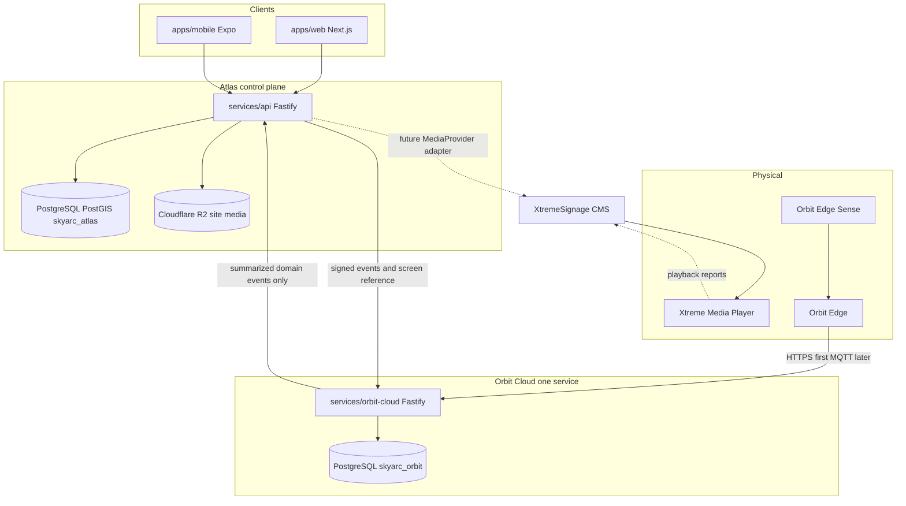
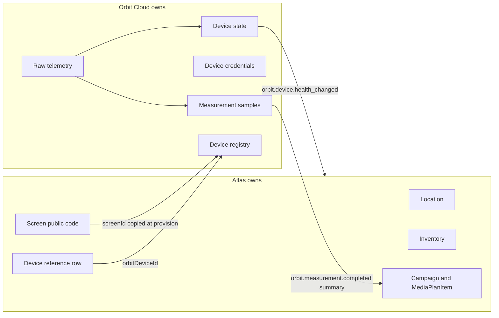

# Atlas Orbit Readiness

**Status:** Assessment only. No Orbit implementation has been started.
**Date:** 2026-09-30
**Evidence:** Current repository source. The code-review graph at `.code-review-graph` is empty (0 nodes), so this document is based on `prisma/schema.prisma`, `services/api`, `apps/web`, `apps/mobile`, `packages/*`, Docker, and CI.

Atlas is a commercial and operational control plane for DOOH planning. It is not an IoT backend, and it must not become one. Orbit Cloud should be a second deployable service in this same monorepo, owning devices and telemetry. Atlas should consume summarized domain events only.

---

## A. Executive Summary

Atlas today is a **pnpm/Turbo monorepo with one backend process**: a modular Fastify monolith (`services/api`) on PostgreSQL/PostGIS, plus a Next.js web app and an Expo field app. Shared domain logic lives in `packages/shared`. There is no second runtime service, no message broker, no Redis, no domain-event bus, and no device or telemetry model.

What already exists and should be reused:

- Location (site) with a Skyarc public code `SKY-{CITY}-{nnn}` (example: `SKY-RAJ-001`)
- Screen as a child of Location, plus face inventory, rate cards, and date-range availability
- Campaign, advertiser, media plan, and a read-only play-based quote
- Organization-scoped RBAC, JWT access tokens, hashed refresh tokens, Argon2 passwords
- Cloudflare R2 for site photos, OpenRouter for planning AI

What blocks Orbit:

1. A physical screen has no Skyarc-owned public identity. `Screen.id` is a UUID. Import code often copies the vendor media code into `Screen.label` and `Inventory.productCode`.
2. There is no device entity. `RefreshToken.deviceLabel` is a user-session label, not hardware.
3. There is no Tenant and no Network. `Organization` means Skyarc internal, a media-owner vendor, or a client. The product is single-operator.
4. Campaign-to-inventory linkage for holds is a notes substring, not a foreign key. There is no creative, no playback schedule, and no measurement.
5. Atlas has no domain events. The only background work is an in-process `setInterval` AI poller.
6. Xtreme is not implemented. The only mention is a future `PlaybackProvider` note in `docs/plans/adtech-booking-engine.md`.

The smallest foundation is additive: give each screen a stable public code, add an Atlas device-reference table, and stand up one `services/orbit-cloud` Fastify service with its own database. Do not rewrite Atlas, do not add Kafka, Kubernetes, TimescaleDB, or Temporal for this milestone, and do not store raw telemetry in Atlas.

---

## B. Current Atlas Architecture

### Repository shape

| Path | What it actually is |
|---|---|
| `apps/web` | Next.js App Router planning UI. Deployed via Vercel (`apps/web/vercel.json`). |
| `apps/mobile` | Expo field survey client with a local SQLite outbox (`apps/mobile/src/sync`). |
| `services/api` | The only backend. Fastify 5, Prisma, one Node process. |
| `packages/shared` | Domain types: RBAC, site codes, occupancy, pricing, delivery math. |
| `packages/validation` | Zod request schemas. |
| `packages/config` | Env schema. |
| `packages/api-client` | Typed HTTP client used by web. |
| `prisma/schema.prisma` | Single PostgreSQL schema. |
| `prisma/migrations/0001`–`0005` | Partial SQL (PostGIS, geo, campaign lifecycle, scoring). Not a full migration history. |
| `scripts/docker-entrypoint.sh` | Production boot runs `prisma db push`, then the API. |
| `docker-compose.yml` | PostGIS 17 + API container. |
| `docker-compose.dev.yml` | Local PostGIS 16 + API. |
| `.github/workflows/ci.yml` | Install, Prisma generate, build, typecheck, test. No deploy job. |

This is a **monorepo containing a modular monolith**, not microservices. Modules are folders inside one Fastify process (`services/api/src/app.ts`). They share one Prisma client and one database. Web and mobile are separate deployable clients of that API. There is no network boundary between “modules.”

### Runtime

```text
Browser / Expo
    │  HTTPS  Authorization: Bearer
    ▼
apps/web (Vercel)  --rewrite /api/*-->  services/api :3001
apps/mobile (Expo) --EXPO_PUBLIC_API_URL--> services/api
    │
    ├── PostgreSQL + PostGIS   (locations, campaigns, inventory)
    ├── Cloudflare R2          (site photos / video / voice notes)
    └── OpenRouter             (brief parse, image analysis) via in-process poller
```

`apps/web/next.config.mjs` rewrites `/api/:path*` to `API_PROXY_TARGET`, and if that env var is unset the fallback is a literal `http://` host. That is a deployment coupling, not an integration boundary.

### API modules (all under `/api/v1`)

Registered in `services/api/src/app.ts`:

| Module | Routes file | Responsibility |
|---|---|---|
| auth | `modules/auth/routes.ts` | Login, refresh, logout |
| users | `modules/users/routes.ts` | Profile and admin user CRUD |
| organizations | `modules/organizations/routes.ts` | Vendor/client orgs and commercial JSON |
| locations | `modules/locations/routes.ts` | Sites, geo, commercial view, archive |
| surveys | `modules/surveys/routes.ts` | Field checklist per location |
| assets | `modules/assets/routes.ts` | Presigned R2 uploads |
| screens | `modules/screens/routes.ts` | Screen CRUD nested under a location |
| inventory | `modules/inventory/routes.ts` | Faces, rate cards, Excel import |
| media-plans | `modules/media-plans/routes.ts` | Advertisers, campaigns, plans, PDF |
| booking | `modules/booking/routes.ts` | `POST /booking/quote` only, feature-flagged |
| intelligence | `modules/intelligence/routes.ts` | Skyarc Index scoring and AI jobs |
| platform | `modules/platform/routes.ts` | Singleton `PlatformConfig` |

### Workers, queues, jobs

- **Server worker:** `services/api/src/workers/analysis-runner.ts` polls `AIAnalysis` rows with `setInterval` inside the API process. No separate worker, no lease beyond a status flip, no retry queue.
- **Mobile outbox:** SQLite in the Expo app. Not a platform queue.
- **No** Redis, BullMQ, SQS, Kafka, NATS, Temporal, cron, or MQTT client anywhere in application code.

### Integrations that exist

| System | Where | Role |
|---|---|---|
| PostgreSQL/PostGIS | Prisma + `prisma/apply-postgis.ts` | System of record |
| Cloudflare R2 | `services/api/src/lib/storage` | Media objects |
| OpenRouter | `services/api/src/lib/ai` | Replaceable `AIProvider` (`stub` or `openrouter`) |
| Google Maps | Seed script only (`GOOGLE_MAPS_API_KEY`) | Optional Street View for Rajkot seed |
| Microsoft Clarity | `apps/web/src/lib/clarity-telemetry.ts` | Product analytics in the browser. Not device telemetry. |
| Xtreme / Orbit | Not in code | — |

### Database

Provider: PostgreSQL. Geography: PostGIS `geography(Point,4326)` on `Location.geom`, maintained by a trigger, not by Prisma queries.

Production schema changes are applied by `prisma db push` (`scripts/docker-entrypoint.sh`), which is non-destructive but does not give a reviewable migration history. The five SQL migrations do not create the core tables; those tables are assumed to already exist or to be created by `db push`.

### Entity relationship (actual names)

```text
Organization 1──* User
User 1──* RefreshToken
User 1──* Location (createdBy)
Organization 1──* Location

Location 1──* Screen
Screen 1──0..1 ScreenSpecification
Screen 1──* Inventory
Inventory 1──* RateCard
Inventory 1──* AvailabilityWindow
Inventory 1──* MediaPlanItem

AdvertiserCategory 1──* Advertiser
Advertiser 1──* Campaign
Campaign 1──0..1 CampaignBrief
Campaign 1──* MediaPlan
MediaPlan 1──* MediaPlanItem
Campaign 1──* Recommendation
Campaign 1──* AIAnalysis
Location 1──* AIAnalysis
Location 1──* LocationAsset
Location 1──0..1 LocationSurvey
Location 1──* LocationAttribute
Location 1──* LocationScore *──1 ScoringConfig

PlatformConfig   (singleton id = "default")
```

There is **no** table named Tenant, Network, Device, Creative, Schedule, Customer, Booking, Order, Playback, or Measurement.

`AvailabilityWindow` is the occupancy record (AVAILABLE / BLOCKED / HELD / BOOKED) over a date range. It has **no** `campaignId` column. Holds are associated by writing the campaign UUID into `notes` (`services/api/src/lib/media-planning/availability.ts`, `windowBelongsToCampaign`).

### Canonical hierarchy vs what exists

Target discussed for Orbit:

```text
Tenant → Network → Location → Screen → Device
```

Actual:

```text
Organization (INTERNAL | VENDOR | CLIENT)
    └── Location   skyarcSiteCode? unique, e.g. SKY-RAJ-001
            └── Screen   UUID only, label text
                    └── Inventory (sellable face)
```

- **Tenant:** absent. One deployment is Skyarc.
- **Network:** absent. `packages/shared/src/markets.ts` is a hardcoded city catalog (`MARKET_CITIES`), not a persisted network.
- **Location:** strong. Geo, org ownership, public site code, vendor code kept internal.
- **Screen:** weak. It exists, but identity is an internal UUID and a free-text label.
- **Device:** absent.

A physical static hoarding is usually one Location, one Screen, one Inventory, created together by Excel import (`services/api/src/modules/inventory/routes.ts`). Digital faces can carry `slotCapacity`, `loopDurationSec`, and `slotDurationSec`. The booking plan already notes that loop length and operating hours are stored and largely unread by the occupancy engine.

---

## C. Existing Capabilities We Can Reuse

Do not rebuild these.

| Capability | Reuse for Orbit |
|---|---|
| `Location` + `skyarcSiteCode` | Site identity. Screen codes should derive from this, not replace it. |
| `Screen` + `ScreenSpecification` | Physical face parent. Add a public code; keep the UUID primary key so `Inventory.screenId` does not change. |
| `Inventory`, `RateCard`, `AvailabilityWindow` | Commercial occupancy. Orbit must not own this. |
| `Campaign`, `MediaPlan`, `MediaPlanItem` | The commercial path from campaign to a face. Measurement later hangs off `MediaPlanItem`, not a new campaign model. |
| `packages/shared/src/delivery.ts` | Play-capacity math (loop, slot, operating hours). Useful later for expected vs measured plays. Not a schedule. |
| `packages/shared/src/slot-occupancy.ts` | Slot occupancy. Keep as the commercial source of truth. |
| `POST /api/v1/booking/quote` | Read-only feasibility. Leave behind `ADTECH_BOOKING`. |
| Auth: Argon2, JWT access, hashed refresh tokens, Helmet, CORS allowlist, global rate limit | Pattern for Orbit **user** admin APIs. Device auth must be separate. |
| `packages/shared` RBAC + `services/api/src/lib/org-scope.ts` | Location read/write scope. Orbit screen references must pass through the same location ACL. |
| R2 storage provider | Site media only. Orbit firmware or large captures, if ever needed, get their own bucket and keys. Not in the first milestone. |
| `AIProvider` seam | Proof that Atlas already uses adapter boundaries. Copy that style for a future media-player adapter. Do not route Orbit through it. |
| Docker Compose + one Dockerfile | Add an `orbit-cloud` service the same way. Do not introduce a cluster. |
| Web location inventory panel | `apps/web/src/components/location-inventory-panel.tsx` already lists screens on a location. Orbit status belongs here as an optional section. |

---

## D. Gaps

| Gap | Why it blocks Orbit |
|---|---|
| No public screen code | Orbit cannot be told “this device is SKY-RAJ-001” without using a UUID or a vendor code as identity. |
| Vendor code used as screen label | `Screen.label` and `Inventory.productCode` are often the vendor IID. That must not become the Orbit key. |
| No external-id map | No place for `xtremePlayerId`, `xtremeScreenId`, or `orbitDeviceId` that is separate from the primary key. |
| No device table | Cannot represent player + Orbit Edge + Sense on one screen. |
| No events | Atlas cannot emit `screen.created` or consume `orbit.device.health_changed` idempotently. |
| No playback record | Cannot connect scheduled play → actual play → measurement. |
| Campaign link on windows is a string match | `notes.includes(campaignId)` will mis-associate or miss. Unsafe as a measurement join. |
| No creative entity | `LocationAsset` is survey/proof photography (`AssetKind`), not an ad creative. |
| Single operator | Another DOOH operator cannot be isolated inside this schema. |
| Client campaign list is unscoped | `GET /campaigns` filters vendors, not `CLIENT_VIEWER`. Every client token can read every campaign. |
| Asset and survey reads skip location ACL | `GET /locations/:id/assets` and `GET /locations/:id/survey` only require a valid JWT. |
| Schema history is `db push` | Additive Orbit tables need a real migration so production and review stay aligned. |
| Xtreme API unknown | No client, no docs in repo. Any playback correlation is blocked on official Xtreme documentation. |

---

## E. Target Architecture

Atlas stays the system of record for commercial objects. Orbit Cloud is one separately deployable Fastify service in this monorepo. Orbit Edge never calls Atlas.





### Orbit Cloud module layout

Match Atlas: TypeScript, Fastify, Zod, Prisma, pnpm workspace, Docker Compose service. One process, folders as modules. Not a microservice per folder.

```text
services/orbit-cloud/
  src/server.ts
  src/app.ts
  src/modules/registry/       device records, screenId binding
  src/modules/provisioning/   claim codes, first-boot
  src/modules/device-auth/    per-device credentials
  src/modules/ingest/         HTTPS telemetry intake
  src/modules/state/          online/offline, last heartbeat, health
  src/modules/telemetry/      raw sample store and retention
  src/modules/events/         outbox and Atlas webhook publisher
  prisma/schema.prisma        separate schema, separate DATABASE_URL
```

MQTT (a single Mosquitto or equivalent container) is added only when an Orbit Edge build can speak MQTT. Until that hardware contract exists, ingestion is HTTPS, which this stack already operates. WebSockets are not required for device ingest. Redis is not required until a multi-instance rate limit or session store is actually needed; the API is one process today. Temporal stays out; `docs/plans/adtech-booking-engine.md` already defers it. Kafka stays out.

### Communication path

```text
Orbit Edge
    → HTTPS POST /ingest/v1/telemetry   (device credential)
    → Orbit Cloud validates, stores, updates device state
    → outbox row
    → HTTPS POST Atlas /api/v1/internal/orbit/events
       HMAC, eventId idempotency
    → Atlas updates device-reference status fields only
```

Atlas never subscribes to a raw telemetry topic.

---

## F. Domain Ownership Matrix

| Domain | Atlas | Orbit Cloud | Notes from this repo |
|---|---|---|---|
| Operator (future Tenant) | Owner | Reference `tenantId` | Not modeled. Implicit single operator: Skyarc. |
| Organization (vendor / client) | Owner | No | Media owner and customer org. Not a device tenant. |
| Network | Not present | No | Do not invent until a second operator or a real network object is approved. City catalog stays in `markets.ts`. |
| Location / site | Owner | No | `skyarcSiteCode` stays here. |
| Screen | Owner | Reference `screenId` only | Public code added on Atlas `Screen`. |
| Inventory, rate card, availability | Owner | No | |
| Campaign, media plan, advertiser | Owner | No | |
| Pricing and commercial JSON | Owner | No | |
| Creative | Not present | No | Future Atlas entity. Not an Orbit object. |
| Playback schedule | Not present | No | Future Atlas or media-player adapter. |
| Device reference (which devices sit on a screen) | Owner of the association | Owner of the Orbit device record | Atlas stores provider, type, external id, last summary. Orbit stores credentials and state. |
| Orbit device credentials | No | Owner | |
| Provisioning | Triggers from Atlas UI | Owner | Atlas asks Orbit to mint a claim code for a `screenId`. |
| Heartbeat, raw telemetry, sensors | No | Owner | |
| Device state summary | Consumer | Owner | Atlas stores the latest summary fields, not samples. |
| Measurement samples | No | Owner | |
| Campaign measurement summary | Owner of the commercial view | Source of the physical summary | |
| Xtreme player and CMS ids | Mapping only | No | Behind a future adapter. |
| Site photos | Owner (R2) | No | |
| User accounts and RBAC | Owner | Separate service credential for Atlas↔Orbit | Do not reuse end-user JWTs as device credentials. |

Current Atlas code does **not** store raw telemetry, so it does not violate the telemetry boundary yet. The violation to prevent is using `LocationAttribute` or `Screen` JSON as a heartbeat sink. `LocationAttribute` is for survey and scoring provenance, not sensors.

---

## G. Required Database Changes

All Atlas changes are additive. Existing UUID primary keys stay. No column drops.

### G1. `Screen.skyarcScreenCode`

On model `Screen` in `prisma/schema.prisma`:

- `skyarcScreenCode String? @unique`
- Index already implied by unique

Backfill, one-time script, not a destructive rewrite:

- Location with exactly one screen and a `skyarcSiteCode`: set `skyarcScreenCode = skyarcSiteCode` (the face and the site are the same asset in current imports).
- Location with more than one screen: `SKY-RAJ-001-F1`, `SKY-RAJ-001-F2`, ordered by `Screen.createdAt`.
- Missing site code: generate with `buildSkyarcSiteCode` from `packages/shared/src/markets.ts` using `Location.city`, then apply the same rule. Do not use `SKY-{uuid slice}` as a stored code. That helper in `publicSkyarcSiteCode` is a display fallback only.

Do not rename existing `SKY-RAJ-###` codes to `SKY-RJT-###`. Rajkot’s prefix in code is `RAJ` (`siteCodePrefix` in `markets.ts`).

Keep `Screen.id` UUID as the foreign key used by `Inventory` and APIs. `skyarcScreenCode` is the permanent business identity Orbit and humans use.

### G2. `ScreenExternalId`

New Atlas table. Mappings only.

```text
ScreenExternalId
  id            UUID PK
  screenId      UUID FK → Screen.id  ON DELETE CASCADE
  provider      String     xtreme | orbit | other
  idType        String     player | cms_screen | orbit_device | other
  externalId    String
  createdAt
  updatedAt
  unique (provider, idType, externalId)
  index (screenId, provider)
```

`orbitDeviceId` lives here and on the device reference. It is never `Screen.id`.

### G3. `Device` (Atlas reference, not telemetry)

Compare the suggested schema to the domain: Atlas needs to list “what is attached to this screen” and the last summary. It must not store secrets or samples.

```text
Device
  id              UUID PK
  screenId        UUID FK → Screen.id
  organizationId  UUID? FK → Organization.id   (copied from Location at bind time)
  provider        String     orbit | xtreme | led_controller | other
  deviceType      String     orbit_edge | orbit_edge_sense | media_player | led_controller | other
  externalId      String     Orbit or provider id
  status          String     unknown | pending | online | offline | revoked
  summaryJson     Json       last health summary only, small
  lastEventAt     DateTime?
  createdAt
  updatedAt
  unique (provider, externalId)
  index (screenId)
```

No credential column. No telemetry JSON array. `summaryJson` is the latest `health_changed` payload, overwritten in place.

`RefreshToken.deviceLabel` stays a user-agent label. Do not overload it.

### G4. Defer, do not migrate yet

| Proposed object | Decision |
|---|---|
| `Tenant` | Decision required. Until approved, Orbit rows carry a constant `tenantId = "skyarc"` string, not a new Atlas table. |
| `Network` | Do not add. Location city/org is enough for the first device. |
| `AvailabilityWindow.campaignId` | Already called out as unfinished in `docs/plans/adtech-booking-engine.md`. Required before measurement, not before device provisioning. Additive nullable FK. |
| `Creative` | Atlas-owned, later. Not an Orbit table. |
| `MeasurementWindow` | Phase 8. See section 13 below. |
| TimescaleDB, Redis | Not in the first schema. |

### G5. Orbit database (separate database, same Postgres instance is acceptable)

```text
orbit_device
  id, tenantId, atlasScreenId, deviceType, status,
  credentialHash, credentialVersion, revokedAt,
  lastSeenAt, health, firmwareVersion, createdAt, updatedAt

orbit_telemetry
  id, deviceId, observedAt, kind, payloadJson
  index (deviceId, observedAt DESC)
  retention job deletes or detaches rows older than a chosen window

orbit_device_state
  deviceId PK, online, health, lastHeartbeatAt, summaryJson, updatedAt

orbit_event_outbox
  eventId PK, eventType, version, tenantId, payload, createdAt, deliveredAt
```

Raw rows never replicate into `skyarc_atlas`.

### G6. Migration mechanics

New Atlas SQL goes in `prisma/migrations/0006_screen_identity/` (and later numbers), and the Docker entrypoint should apply committed SQL as well as `db push` until `migrate deploy` replaces `db push`. Do not `db push` against a shared production database as the only record of Orbit tables.

---

## H. Required API Contracts

Existing screen routes stay. They are location-nested and UUID-keyed:

- `GET /api/v1/locations/:id/screens`
- `POST /api/v1/locations/:id/screens`
- `PATCH /api/v1/screens/:id`
- `PUT /api/v1/screens/:id/specification`

Add, without removing those:

| API | Owner | Purpose |
|---|---|---|
| `GET /api/v1/screens/by-code/:skyarcScreenCode` | Atlas | Resolve public code to the screen Atlas already knows. Auth required. |
| `GET /api/v1/screens/:id/devices` | Atlas | Device references for that screen. Empty array if none. |
| `POST /api/v1/screens/:id/devices` | Atlas | Bind a provider device. Calls Orbit only when `provider=orbit`. |
| `GET /api/v1/screens/:id/orbit-status` | Atlas | Reads `Device.summaryJson` for `provider=orbit`. `404` or `{ attached: false }` when none. |
| `POST /api/v1/internal/orbit/events` | Atlas | HMAC from Orbit. Idempotent on `eventId`. Not a public browser route. |

Do not add `GET /screens/:id/telemetry`.

Orbit Cloud, not exposed to the browser:

| API | Purpose |
|---|---|
| `POST /provision/v1/claim` | Called by Atlas with a service credential. Body: `atlasScreenId`, `skyarcScreenCode`, `deviceType`. Returns a one-time claim code. |
| `POST /provision/v1/enroll` | Called by the device with the claim code. Returns device credential. |
| `POST /ingest/v1/heartbeat` | Device credential. |
| `POST /ingest/v1/telemetry` | Device credential. Batch of samples. |
| `POST /devices/v1/:id/revoke` | Atlas service credential. |

Atlas passes `skyarcScreenCode` and `screenId` at provision time. Orbit stores that reference. Orbit does not read campaigns, prices, or inventory.

### Measurement APIs (later, not part of the provisioning milestone)

- `GET /api/v1/screens/:id/measurements` returns Atlas `MeasurementWindow` summaries.
- `GET /api/v1/campaigns/:id/measurements` joins `MediaPlanItem` → inventory → screen → windows.

Both return commercial summaries. Sample arrays stay in Orbit.

---

## I. Event Contracts

Atlas has no event infrastructure. Add the smallest outbox that earns its keep: a table plus a publisher. Do not add an event bus product.

### Envelope

```text
eventId          UUID
eventType        string
version          integer  (starts at 1)
tenantId         string   ("skyarc" until a Tenant exists)
timestamp        ISO-8601
source           "atlas" | "orbit-cloud"
correlationId    UUID
payload          object
```

Consumers dedupe on `eventId`. A new payload shape increments `version` and keeps the old version parsable. Unknown versions are stored and ignored, not crashed.

### Who publishes what

| Event | Publisher | Consumer | When it becomes real |
|---|---|---|---|
| `screen.created` | Atlas | Orbit, optional | Phase 1–2, so Orbit can refuse unknown screen codes |
| `screen.updated` | Atlas | Orbit | When public code or archive state changes |
| `campaign.booked` | Atlas | none at first | After `AvailabilityWindow.campaignId` exists. Do not emit from notes parsing. |
| `campaign.started` / `campaign.completed` | Atlas | measurement | After lifecycle is trustworthy. `CampaignLifecycleStatus` already exists. |
| `creative.published` | Atlas | Xtreme adapter | Blocked on Xtreme docs and a Creative model |
| `orbit.device.connected` | Orbit | Atlas | Updates `Device.status` |
| `orbit.device.disconnected` | Orbit | Atlas | Same |
| `orbit.device.health_changed` | Orbit | Atlas | Replaces `summaryJson` |
| `orbit.power.degraded` | Orbit | Atlas | Alert summary only |
| `orbit.measurement.completed` | Orbit | Atlas | Phase 8, summary payload |
| `orbit.alert.created` | Orbit | Atlas | Summary only |

Atlas must not subscribe to heartbeat or GPS streams. Orbit collapses those into the events above.

Idempotency: Atlas `OrbitEventReceipt` table (`eventId` primary key). Replay returns 200 with the original result.

---

## J. Security Architecture

### Device trust (new, Orbit Cloud)

| Control | Design |
|---|---|
| Per-device identity | `orbit_device.id` generated by Orbit, mapped to Atlas `skyarcScreenCode`. |
| Per-device credentials | Random secret, stored as a hash. Shown once at enroll. |
| Rotation | New secret, `credentialVersion++`, previous version accepted for a short overlap, then rejected. |
| Revocation | `revokedAt` set. Ingest rejects. Atlas `Device.status = revoked`. |
| MQTT ACL | Only if MQTT is deployed. Each device may publish `orbit/{tenantId}/{deviceId}/#` and nothing else. No subscribe to other devices. |
| Replay | HTTPS: timestamp window plus nonce stored for that window. MQTT: same inside the payload. |
| Signed commands | Not in the first milestone. No remote command channel until a command schema exists. When added, commands are signed by Orbit Cloud and include expiry and a nonce. |
| Rate limit | Per-device limit on ingest, separate from the Atlas 100 req/min user limit. |
| Provisioning | Claim code is single-use, short TTL, bound to one `atlasScreenId`. |
| Firmware verification | Record `firmwareVersion` and a hash reported by the device. Signature verification waits on the firmware signing design. Do not pretend it exists. |
| Audit | Append-only `orbit_audit` for enroll, rotate, revoke, and rejected ingest. |
| Tenant isolation | Every Orbit row has `tenantId`. Queries from Atlas include it. With one operator this is a constant, still a required column so a second operator is not a rewrite. |

Edge firmware must not embed an Atlas user JWT or the Atlas database URL.

### Atlas findings relevant to this integration

Classified from the current code. No secrets are reproduced here.

| Severity | Finding |
|---|---|
| HIGH | `GET /api/v1/locations/:id/assets` (`services/api/src/modules/assets/routes.ts`) and `GET /api/v1/locations/:id/survey` (`modules/surveys/routes.ts`) authenticate the caller and then load the row with no `canAccessLocation` check. Any valid token plus a UUID reads asset keys and survey text. |
| HIGH | `GET /api/v1/campaigns` scopes vendors and does not scope `CLIENT_VIEWER` (`modules/media-plans/routes.ts`). A client token lists every campaign, including other clients’ budgets and briefs. Same pattern on `GET /campaigns/:id` unless the vendor branch applies. |
| HIGH | `apps/web/next.config.mjs` falls back to a hardcoded `http://` API host when `API_PROXY_TARGET` is unset. Browser traffic rewritten through Next would cross the network in cleartext, including bearer tokens. |
| MEDIUM | `POST /users/:id/reset-link` builds an unsigned base64 JSON blob (`userId`, `email`, `exp`) and returns it. Login does not redeem it today, so this is not a current authentication bypass. It must not be wired up as-is. |
| MEDIUM | Refresh tokens are not rotated. `POST /auth/refresh` reissues an access token and returns the same refresh token. Theft works until expiry (`JWT_REFRESH_EXPIRES_IN`, default 30 days in the Zod schema if unset). |
| MEDIUM | Access-token default in `packages/config/src/index.ts` is `7d` when `JWT_ACCESS_EXPIRES_IN` is omitted. `.env.example` says `15m`. A missed production env var widens the token window. |
| MEDIUM | Login uses the global limiter of 100 requests per minute (`app.ts`). No tighter credential-stuffing limit. |
| MEDIUM | Access and refresh tokens are in `localStorage` (`apps/web/src/lib/api.ts`). Any future XSS becomes an account takeover. Map popup HTML is escaped (`apps/web/src/lib/map-popup.ts`). No `dangerouslySetInnerHTML` usage was found. |
| MEDIUM | `/docs` and `/docs/openapi.yaml` are unauthenticated (`plugins/openapi.ts`). |
| LOW | README documents seed admin `admin@skyarc.in` / `ChangeMe123!`. The container entrypoint does not run `seed-full` automatically. Production must not be seeded with that password. |
| LOW | `docker-compose.dev.yml` uses database password `skyarc` and placeholder JWT secrets. Acceptable for local compose only. |
| LOW | `.deploy/` is gitignored. It holds local deployment material and must stay untracked. |
| LOW | Vendor `canAccessLocation` returns true for every non-archived location (`packages/shared/src/rbac.ts`). Writes are org-scoped. Reads are a marketplace choice. Commercial fields are scrubbed in location serialization; campaign reads are not equivalently scrubbed. |

Not found, or not applicable:

- CSRF against the API: auth is `Authorization: Bearer`, not cookies.
- Path traversal on R2 keys: `slugifyLocationFolder` strips to `[a-z0-9-]`.
- Upload type and size limits exist (`MEDIA_LIMITS`, content-type allowlist).
- SSRF: no user-controlled server-side fetch URL in the API paths reviewed. The Next rewrite target is env or a constant, not request input.
- Payments: no payment endpoint, so no frontend-only payment check.
- Webhooks: none today. Orbit’s webhook must be HMAC from day one.
- Source maps: `productionBrowserSourceMaps` is not enabled.
- JWT secret length: Zod requires 32 characters. `JWT_REFRESH_SECRET` is required by env schema and is not used by the refresh implementation (refresh tokens are random and SHA-256 stored). Unused secret is not itself a vulnerability.

These HIGH items are prerequisites in Phase 0 because Orbit will attach more sensitive operational state to the same identity model. They are application defects, not a reason to redesign Atlas.

---

## K. Xtreme Integration Strategy

### Confirmed from the repository

- No Xtreme client, model, environment variable, or adapter.
- Screen identity is not an Xtreme id.
- Content storage is R2 for site photography, not ad delivery.
- `docs/plans/adtech-booking-engine.md` says playback is absent and should become a `PlaybackProvider` with an Xtreme adapter later. It also says not to couple tightly. That plan is unfinished (quote API exists; `AvailabilityWindow.campaignId` does not).

### Assumption, not a design we can implement

XtremeSignage remains the CMS and player. Skyarc will not build a player. The future boundary is:

```text
Atlas campaign / schedule
    → MediaProvider interface in packages/shared or services/api/src/lib/media-provider
    → XtremeSignageAdapter
    → XtremeSignage
```

Capabilities that **would** belong on that interface, once official docs exist:

```text
getScreens()
getScreenStatus()
publishCampaign()
updateSchedule()
getPlaybackReport()
```

Every one of those is **unconfirmed**. Do not invent request paths, auth, or payload fields.

### What to build before Xtreme docs exist

- The interface as a type with one `UnsupportedMediaProvider` implementation that returns a clear error.
- `ScreenExternalId` rows with `provider=xtreme` left empty until ids are known.
- No Xtreme types in `Campaign`, `Inventory`, or `Screen` columns.

Playback correlation (Phase 9) cannot start until Xtreme documents how a play log identifies a screen and a time window.

---

## L. Migration Strategy

Principle: existing locations, campaigns, media plans, and availability windows keep working. New columns are nullable or defaulted. Old UUID routes remain.

| Area | Risk | Safe move |
|---|---|---|
| Existing screens | Rows have UUID and label only | Backfill `skyarcScreenCode`. Do not change `Screen.id`. |
| Inventory import | Creates screen label from vendor media code | Keep label. Stop using it as identity. New imports also set `skyarcScreenCode`. |
| Bookings | Holds live in `AvailabilityWindow.notes` | Leave the notes behavior in place. Add nullable `campaignId` later and dual-read. |
| Campaigns | No schema change in Phases 1–7 | |
| Auth | No change to JWT shape in the device work | Phase 0 ACL fixes are behavior fixes, not token-format changes. |
| APIs | Clients call `/locations/:id/screens` | Keep. Add routes. Serializers gain `skyarcScreenCode` as an extra field. |
| Web routes | No screen detail route exists. Screens render inside the location page. | Add an optional panel. Do not move inventory UI. |
| Mobile | Field app creates locations, not Orbit devices | No mobile change until a field-provisioning story is approved. |
| Database | `db push` on boot | Ship SQL migrations for new tables so a failed backfill is visible. Run backfill as a script (`prisma/backfill-screen-codes.ts`), idempotent, dry-run first. |
| Production data | Site codes already look like `SKY-RAJ-001` | Preserve them. Only synthesize codes where null. |

Rollback: new tables and nullable columns can be ignored by old code. Do not drop them in the same release that adds them.

---

## M. Implementation Phases

Sequence is dependency order. Sizes are relative effort from this codebase, not calendar dates.

### Phase 0 — Prerequisites (M)

Close the authorization gaps that would leak Orbit status the same way surveys leak today. Establish a migration file for the next schema change. No Orbit service yet.

### Phase 1 — Canonical screen identity (M)

Additive `skyarcScreenCode`, backfill, import path, API field. Atlas still has no devices.

### Phase 2 — Device reference on Atlas (M)

`Device` and `ScreenExternalId` tables and CRUD. Orbit ids can be stored before Orbit Cloud exists. No telemetry columns.

### Phase 3 — Orbit Cloud skeleton (L)

New workspace package, own Prisma schema, health check, Compose service, CI build. No devices enrolled.

### Phase 4 — Provisioning and device auth (L)

Claim code from Atlas, enroll, hashed device secret, revoke. Still no telemetry retention requirement beyond a rejected-or-accepted heartbeat if needed to prove auth.

### Phase 5 — Telemetry ingestion (L)

HTTPS batch ingest, validation, `orbit_telemetry` insert, retention. Atlas untouched.

### Phase 6 — Device state (M)

Online/offline from heartbeat timeout, health enum, outbox row on change.

### Phase 7 — Atlas integration (M)

Signed event delivery. Atlas `Device.summaryJson` updates. Location screen panel shows status and hides itself when no Orbit device exists.

**Definition of Done is Phase 7.** Phases 8–10 are explicitly after that milestone.

### Phase 8 — Measurement foundation (L)

Nullable `AvailabilityWindow.campaignId`, `MeasurementWindow` summary table, consume `orbit.measurement.completed`. Requires a decision on what Orbit actually measures.

### Phase 9 — Xtreme playback correlation (XL)

Blocked on official Xtreme playback-report documentation. Adapter only.

### Phase 10 — Orbit Edge Sense (M)

New `deviceType` and measurement kinds. No new service. Schema already allows more than one device per screen.

---

## N. Exact File-Level Change Plan

### Phase 0

**Modify**

- `services/api/src/modules/assets/routes.ts` — `GET /locations/:id/assets` calls `canAccessLocation`.
- `services/api/src/modules/surveys/routes.ts` — `GET /locations/:id/survey` calls `canAccessLocation`.
- `services/api/src/modules/media-plans/routes.ts` — campaign list and get restrict `CLIENT_VIEWER` to campaigns they created (or their organization, once a client-org link is confirmed). Do not change vendor inbound site-request behavior.
- `apps/web/next.config.mjs` — remove the hardcoded HTTP fallback; require `API_PROXY_TARGET` outside local dev.
- `packages/config/src/index.ts` — default access TTL to `15m` to match `.env.example`.
- `services/api/src/modules/users/routes.ts` — stop returning an unsigned reset blob, or stop generating the route until a hashed one-time token exists.
- `scripts/docker-entrypoint.sh` — document and, if approved, run `prisma migrate deploy` for committed SQL before `db push`.

**Create**

- `services/api/src/tests/authz-scope.test.ts` — asset, survey, and client campaign denial cases.

**Migrations / APIs / infra:** none new. Tests and config only.

### Phase 1

**Modify**

- `prisma/schema.prisma` — `Screen.skyarcScreenCode String? @unique`.
- `services/api/src/modules/screens/routes.ts` — serializer and create path assign a code.
- `services/api/src/modules/inventory/routes.ts` — Excel import sets the code; does not use vendor IID as the code.
- `packages/shared/src/site-display.ts` — add `buildSkyarcScreenCode(siteCode, faceIndex)` next to `buildSkyarcSiteCode` usage. Keep `publicSkyarcSiteCode` for locations.
- `packages/shared/src/markets.ts` — only if a screen-code helper belongs beside `buildSkyarcSiteCode`.
- `packages/validation/src/index.ts` — optional `skyarcScreenCode` on screen create/update schemas.
- `apps/web/src/components/location-inventory-panel.tsx` — show the code beside the label.
- `apps/web/src/app/(app)/locations/[id]/page.tsx` — no route change; it already hosts the inventory panel.

**Create**

- `prisma/migrations/0006_screen_public_code/migration.sql`
- `prisma/backfill-screen-codes.ts`
- `services/api/src/tests/screen-code.test.ts`

**APIs:** existing screen routes gain the field. Add `GET /api/v1/screens/by-code/:skyarcScreenCode` in `screens/routes.ts`.

**Config / infra:** none.

### Phase 2

**Modify**

- `prisma/schema.prisma` — `Device`, `ScreenExternalId`.
- `services/api/src/modules/screens/routes.ts` — or a new module registered from `app.ts`.
- `services/api/src/app.ts` — register device routes.
- `packages/validation/src/index.ts` — device body schema.
- `packages/shared/src/index.ts` — device provider and type constants.

**Create**

- `services/api/src/modules/devices/routes.ts`
- `prisma/migrations/0007_device_reference/migration.sql`
- `services/api/src/tests/devices.test.ts`

**APIs:** `GET/POST /api/v1/screens/:id/devices`, `PATCH /api/v1/devices/:id` (status only).

### Phase 3

**Create**

- `services/orbit-cloud/package.json`
- `services/orbit-cloud/tsconfig.json`
- `services/orbit-cloud/src/server.ts`
- `services/orbit-cloud/src/app.ts`
- `services/orbit-cloud/src/modules/health.ts`
- `services/orbit-cloud/prisma/schema.prisma`
- `services/orbit-cloud/src/tests/health.test.ts`

**Modify**

- `pnpm-workspace.yaml` — already includes `services/*`.
- `turbo.json` — only if the new package’s `dev`/`build` tasks need explicit outputs.
- `docker-compose.yml` — `orbit-cloud` service, `ORBIT_DATABASE_URL`, no host port published beyond what ops chooses.
- `Dockerfile` — prefer a second Dockerfile `services/orbit-cloud/Dockerfile` so the Atlas image does not grow.
- `.github/workflows/ci.yml` — `pnpm --filter @skyarc/orbit-cloud test` is covered if `pnpm test` runs all workspace tests. Confirm the package script exists.
- `.env.example` — `ORBIT_DATABASE_URL`, `ORBIT_SERVICE_TOKEN` placeholders, no real secrets.

**Infrastructure:** second database `skyarc_orbit` on the existing Postgres container (`POSTGRES_MULTIPLE_DATABASES` or an init script in `prisma/docker-init`). Not a new database server.

### Phase 4

**Create**

- `services/orbit-cloud/src/modules/provisioning/routes.ts`
- `services/orbit-cloud/src/modules/device-auth/routes.ts`
- `services/orbit-cloud/src/lib/credentials.ts`
- `services/orbit-cloud/prisma` models `OrbitDevice`, `ClaimCode`, `Audit`
- `services/orbit-cloud/src/tests/enroll.test.ts`

**Modify**

- `services/api/src/modules/devices/routes.ts` — `POST` for `provider=orbit` calls Orbit provision with a service token.
- `packages/config/src/index.ts` — optional `ORBIT_CLOUD_URL`, `ORBIT_SERVICE_TOKEN`.

**APIs:** Orbit `POST /provision/v1/claim`, `POST /provision/v1/enroll`, `POST /devices/v1/:id/revoke`.

### Phase 5

**Create**

- `services/orbit-cloud/src/modules/ingest/routes.ts`
- `services/orbit-cloud/src/modules/telemetry/store.ts`
- `services/orbit-cloud/src/tests/ingest.test.ts`
- Prisma model `OrbitTelemetry` with index `(deviceId, observedAt)`

**Modify**

- Orbit retention: a `setInterval` in the Orbit process, same pattern as `analysis-runner.ts`, deleting rows past the retention window. No new broker.

**APIs:** `POST /ingest/v1/telemetry`, `POST /ingest/v1/heartbeat`.

### Phase 6

**Create**

- `services/orbit-cloud/src/modules/state/projector.ts`
- `services/orbit-cloud/src/modules/events/outbox.ts`
- Prisma models `OrbitDeviceState`, `OrbitEventOutbox`

**Modify**

- Ingest path writes state and, on transition, an outbox row.

### Phase 7

**Create**

- `services/api/src/modules/orbit-events/routes.ts`
- `services/api/src/lib/orbit/verify-signature.ts`
- `prisma` model `OrbitEventReceipt`
- `apps/web/src/components/screen-orbit-panel.tsx`
- `services/api/src/tests/orbit-events.test.ts`
- `apps/web` test or component test if the web package already uses Vitest (`apps/web/src/tests` exists).

**Modify**

- `services/api/src/app.ts` — register internal event route.
- `apps/web/src/components/location-inventory-panel.tsx` — render `ScreenOrbitPanel` when a device reference exists.
- `apps/web/src/app/(app)/locations/[id]/page.tsx` — pass screen id through; page must still load if the Orbit request fails.

**APIs:** `POST /api/v1/internal/orbit/events`, `GET /api/v1/screens/:id/orbit-status`.

**Config:** `ORBIT_WEBHOOK_SECRET` on both services.

### Phase 8

**Modify**

- `prisma/schema.prisma` — nullable `AvailabilityWindow.campaignId`, new `MeasurementWindow`.
- `services/api/src/lib/media-planning/availability.ts` — write the FK and keep notes until callers migrate.
- `services/api/src/modules/media-plans/routes.ts` — hold/book paths.
- `packages/shared/src/delivery.ts` — only if a summary type belongs next to play math.

**Create**

- `prisma/migrations/0008_measurement_window/migration.sql`
- `services/api/src/modules/measurements/routes.ts`
- `services/api/src/tests/measurement-window.test.ts`

`MeasurementWindow` fields, fitted to this schema:

```text
id
mediaPlanItemId    FK MediaPlanItem
screenId           FK Screen
campaignId         FK Campaign          (denormalized for query)
availabilityWindowId  UUID?             (once campaignId exists on the window)
playbackStart      DateTime?            (null until Xtreme)
playbackEnd        DateTime?
measurementStart   DateTime
measurementEnd     DateTime
orbitMeasurementId String?              (external id, not a sample blob)
summaryJson        Json                 (counts, health, not raw series)
createdAt
```

No `creativeId` until a Creative model exists. Do not store Orbit samples.

### Phase 9

**Create**

- `services/api/src/lib/media-provider/types.ts`
- `services/api/src/lib/media-provider/unsupported.ts`
- `services/api/src/lib/media-provider/xtreme.ts` — only after official docs; until then the file is a stub that throws a typed “not configured” error.

**Modify**

- No campaign module imports of Xtreme-specific fields.

### Phase 10

**Modify**

- Orbit ingest kind enum to accept Sense measurements.
- Atlas `Device.deviceType` already allows `orbit_edge_sense` from Phase 2.
- `ScreenOrbitPanel` shows Sense only when that device type is present.

No new service.

---

## O. Risk Register

| Risk | Likelihood | Impact | Mitigation |
|---|---|---|---|
| Backfill assigns the same code to two faces | Medium | High | Unique constraint. Dry-run script. Multi-face sites get `-F1` suffixes. |
| Import keeps writing vendor codes into `productCode` and someone uses that as screen id | High | High | Public code is a separate column. Docs and API reject vendor-shaped codes as `skyarcScreenCode`. |
| `db push` drifts from committed SQL | High | Medium | Phase 0 entrypoint runs committed migrations. Review SQL in git. |
| Client campaign leak ships into Orbit status | Medium | High | Phase 0 ACL before any Orbit fields are added to campaign or location payloads. |
| Notes-based campaign link used for measurement | High if rushed | High | Phase 8 blocked on a real `campaignId` FK. |
| Orbit Cloud duplicates inventory or campaigns | Medium | High | Provision payload is screen id and code only. Code review rule: no Campaign model in `services/orbit-cloud`. |
| Raw telemetry written to Atlas `summaryJson` | Medium | High | Schema comment and a size guard. Event payload schema rejects arrays of samples. |
| MQTT added before a device exists | Medium | Medium | HTTPS ingest first. MQTT compose service is a later opt-in. |
| Xtreme adapter invented from guesses | Medium | High | Phase 9 stub only. External ids stay nullable. |
| Second operator onboarded on today’s org model | Low near-term | High | `tenantId` column on Orbit from Phase 4. No Atlas Tenant table until a product decision. |
| Token theft via the hardcoded HTTP proxy | Medium if env is unset | High | Phase 0 removes the fallback. |
| Heartbeat timeout flapping marks screens offline | Medium | Medium | Timeout and debounce in Orbit state projector before emitting `disconnected`. |
| Existing location page breaks when Orbit is down | Medium | Medium | Panel treats network failure as “status unavailable” and still shows inventory. |

---

## P. Definition of Done: Atlas Orbit Ready

The milestone is met when all of the following are true in this repository, without Atlas storing raw telemetry:

1. Every existing screen that is a single face on a coded site has a unique `skyarcScreenCode`, and new screens receive one at create time.
2. An operator can attach an Orbit device reference to that screen from Atlas.
3. The device enrolls with Orbit Cloud using a one-time claim and a per-device secret. Atlas user JWTs are not device credentials.
4. The device posts heartbeats and telemetry to Orbit Cloud over HTTPS. Orbit stores them in `skyarc_orbit`.
5. Orbit marks the device online or offline from heartbeats and keeps telemetry history subject to retention.
6. On state change, Orbit sends one signed, idempotent event to Atlas.
7. Atlas shows the summary on the location screen panel and shows nothing operational when the screen has no Orbit device.
8. Existing campaign, inventory, location, and auth flows still pass their current tests.
9. Revoking the device stops ingest and surfaces `revoked` on the Atlas reference.

That is the foundation. Measurement, Xtreme playback, and Sense are later phases and are not required for this milestone.
